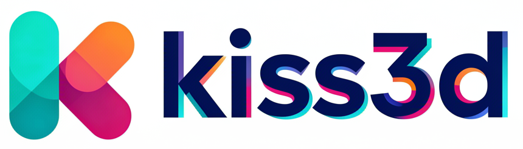

<a align="center" href="https://kiss3d.rs">
  <a href="https://kiss3d.rs"></a>
</a>

<p align="center">
    <a href="https://discord.gg/vt9DJSW">
        
    </a>
    <a href="https://github.com/sebcrozet/kiss3d/actions">
        
    </a>
    <a href="https://crates.io/crates/kiss3d">
         
    </a>
</p>

Keep It Simple, Stupid 3D and 2D graphics engine.

This library is born from the frustration that today’s 3D
graphics library are either:

* **Too low level**: you have to write your own shaders and opening a
  window takes 8 hours, 300 lines of code and 10L of coffee.
* High level, but **too hard to understand/use**: these libraries are made to
  create beautiful photoreal (or close to it) animations or games.
  They have many features; too many, in fact, if you just want to draw a few objects
  on the screen with as little friction as possible.

**kiss3d** is not designed to be feature-complete or fast.
It is designed to let you draw simple geometric figures and play with them
with as little friction as possible.

## Features

* WASM compatible.
* Out of the box, open a window with a default arc-ball camera and a point light.
* First-person camera available as well, and user-defined cameras are possible.
* Render boxes, spheres, cones, cylinders, quads and lines simply
* Change an object's color or texture.
* Change an object's transform.
* Create basic post-processing effects.

As an example, creating a scene with a red, rotating cube with a light attached
to the camera is as simple as:

```rust
use kiss3d::prelude::*;

#[kiss3d::main]
async fn main() {
  let mut window = Window::new("Kiss3d: cube").await;
  let mut camera = OrbitCamera3d::default();
  let mut scene = SceneNode3d::empty();
  scene
          .add_light(Light::point(100.0))
          .set_position(Vec3::new(0.0, 2.0, -2.0));

  let mut c = scene.add_cube(1.0, 1.0, 1.0).set_color(RED);

  let rot = Quat::from_axis_angle(Vec3::Y, 0.014);

  while window.render_3d(&mut scene, &mut camera).await {
    c.rotate(rot);
  }
}
```

This code works on **both native platforms and WASM** without any changes! The `#[kiss3d::main]`
macro and `async` rendering API handle the platform differences automatically:

* **On native**: The async runtime is managed with `pollster::block_on`
* **On WASM**: The async function integrates with the browser's event loop via `requestAnimationFrame`

This approach eliminates the need for platform-specific code or managing different entry points,
making it simple to write truly cross-platform 3D applications.

Some controls are handled by default by the engine (they can be overridden by the user):

* `scroll`: zoom in / zoom out.
* `left click + drag`: look around.
* `right click + drag`: translate the view point.
* `enter`: look at the origin (0.0, 0.0, 0.0).

## Compilation

You will need the last stable build of the [rust compiler](http://www.rust-lang.org)
and the official package manager: [cargo](https://github.com/rust-lang/cargo).

Simply add the following to your `Cargo.toml` file:

```toml
[dependencies]
kiss3d = "0.37"
```
### Optional Features

#### Recording

Kiss3d supports recording your 3D scene to MP4 video files. This feature requires FFmpeg to be installed on your system.

**Install FFmpeg:**
- macOS: `brew install ffmpeg`
- Ubuntu/Debian: `sudo apt install ffmpeg libavcodec-dev libavformat-dev libavutil-dev libswscale-dev`
- Windows: Download from [ffmpeg.org](https://ffmpeg.org/download.html) and add to PATH

**Enable the feature in your Cargo.toml:**
```toml
[dependencies]
kiss3d = { version = "0.37", features = ["recording"] }
```

#### Egui Integration

For immediate mode GUI support, enable the `egui` feature:
```toml
[dependencies]
kiss3d = { version = "0.37", features = ["egui"] }
```
